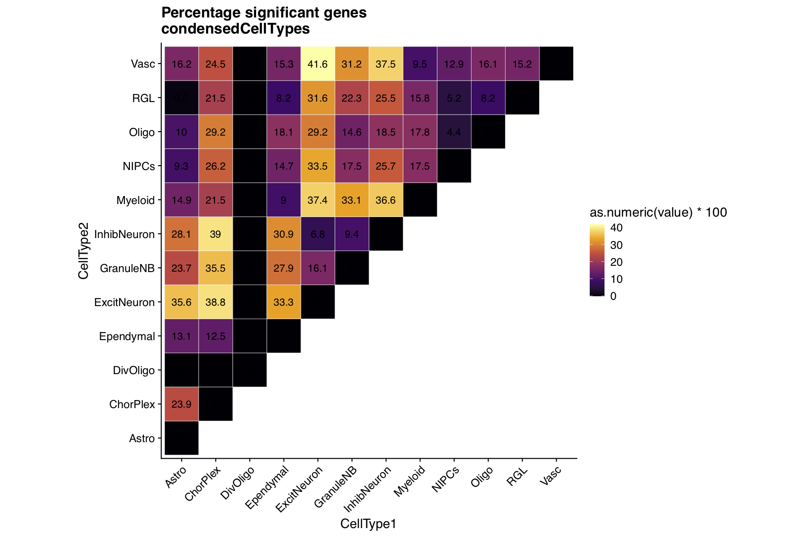

```{r setup, include = FALSE}
knitr::opts_chunk$set(
  collapse = TRUE,
  comment = "#>"
)
```

The *scisorseqr* package allows you to go from short-read, single cell assignments and a set of fastq files to a full-blown cell-type specific analysis of alternative splicing patterns. 

## Setup

### Software required

 * [STARlong](https://github.com/alexdobin/STAR/) (and corresponding genome index file)
 * [Minimap2](https://github.com/lh3/minimap2) if not using STARlong
 * samtools
 * bedtools
 * python version >= 3.7 with the following libraries
   * pandas
   * multiprocessing


### Quick cheat for viewing documentation
All the possible arguments, usage, and description for each function can be viewed interactively
by putting a "?" in front of the function name in the R console like so:

```{r demonstrateMan, include = TRUE, eval = FALSE}
?GetBarcodes
```


## Step 1: Barcode deconvolution 
The first step is to deconvolve barcodes from either the PacBio or ONT fastq output
For that the user needs to specify

 - Tab separated Barcode-Celltype file
 - Directory containing fastq.gz files
 
### Create a barcode - celltype file 
Assuming that short read single-cell analysis has been performed using Seurat:
```{r makeBCfile, eval=FALSE, echo=TRUE}
library(Seurat)
library(tidyr)
library(dplyr)

bc <- data.frame("Barcode"=rownames(my_object@meta.data),
                 "Celltype"=my_object@meta.data$celltype) %>% 
  separate(Barcode,into=c("BC","suffix"),sep="-") %>% 
  select(-suffix) %>% as.data.frame()

write.table(bc, file = "PATH_TO_FILE", sep="\t", row.names = FALSE,
            col.names = FALSE, quote = FALSE)
```

The table should look something like this
```{r, echo=FALSE}
bc_clust <- read.table(system.file("extdata/", "userInput/bc_celltype_assignments", 
                                   package = "scisorseqr"), 
                       header = FALSE, sep = "\t")
knitr::kable(bc_clust[sample(nrow(bc_clust),8,replace = FALSE),], 
             row.names = FALSE)
```


### Use that file to locate barcodes from the fastq files
Example files included in the package and loaded  as follows:
```{r getBarcodes, eval=FALSE, echo=TRUE}

bc_clust <- system.file("extdata/", "userInput/bc_celltype_assignments", 
                        package = "scisorseqr")
fastqFolder <- system.file("extdata/", "userInput/FastqFiles/", 
                           package = "scisorseqr")

## run command
GetBarcodes(fqFolder = fastqFolder, BCClustAssignFile = bc_clust, 
            chemistry = "v2", concatenate = TRUE, filterReads = FALSE)
```

You will see two output directories

- OutputRaw
    - file.CSV (One line per read)
    - file_summary (Stats for run)
- OutputFiltered
    - file.CSV (One line per barcoded read with the following structure:)

|ReadName |T9_Status |Strand|T9_pos|Barcodes|BC_pos|Cluster|UMI|TSO_Status|TSO_pos|Length|
|:----------|:-----|:---|:--|:----------------|:--|:-----------|:----------|:---------|:--|:----|
|ReadX|poly_T_found|rev|47|GTCGGGTTCCAAAGTC|22|Hipp_GranuleNB|ATGGCGGGAT|TSO_found|26|913|
|ReadY|poly_T_found|fwd|48|AGTGCCGATAGTTATG|22|Hipp_Astro|GGGATATGGC|TSO_found|26|1312|

<br>

**NOTE 1** If you want to limit the downstream analysis to barcoded reads only, set the 'filterReads' parameter to TRUE. This will output a fastq.gz file in the OutputFiltered directory.
<br>

**NOTE 2** Setting 'concatenate' to FALSE ensures that your input files are treated as separate samples.

## Step 2: Align your fastq files to the reference

We have made two aligners available and compatible with our package

* STARlong
* Minimap2

```{r STARalign, eval = FALSE, echo = TRUE}

## Load example data
fastqFolder <- system.file("extdata/", "userInput/FastqFiles/", 
                           package = "scisorseqr")

STARalign(fqFolder = fastqFolder, starProgPath = '~/bin/Linux_x86_64/STARlong',
          refGenomeIndex = '~/starIndex_gencode10/',
          numThreads = 24)

MMalign(fqFolder = fastqFolder, mmProgPath = '~/minimap2/minimap2',
        refGenome='~/genomes/mm10.fa',
        numThreads = 16)
```

This process will convert all the aligned sam files to bam files, and dump the output along with run reports into *STARoutput* or *MMoutput*

## Step 3: Map and filter for full-length, spliced reads
We used annotated [CAGE peaks](https://fantom.gsc.riken.jp/5/datafiles/reprocessed/mm10_latest/extra/CAGE_peaks/) and [PolyA sites](https://polyasite.unibas.ch/atlas) for our study

```{r MapAndFilter, eval = FALSE, echo = TRUE}
MapAndFilter(annoGZ='[PATH_TO_annotation.gtf.gz]',numThreads=24, 
             seqDir = '[PATH_TO_GENOME_DIR/chr*.fa.gz]',
             filterFullLength=TRUE,
             cageBed = '[PATH_TO_Cage.bed.gz]',
             polyABed = '[PATH_TO_PolyA.bed.gz]',
             cp_distance=50, genomeVersion="mm10")

```

**NOTE 1:**  the parameter seqDir takes in a reference genome broken down by chromosome so
as to parallelize the process.
This function has not yet been made generalizable to loading in the full reference
<br>

**NOTE 2:** The genome and version is not auto-detected and hence defaults to 'mm10'. It does not affect any processing but might lead to confusion if processing a different species.
<br>

This will result in multiple files being stored in yet another output directory: *LRProcessingOutput*. A lot of these files
are not super relevant and there is an option to remove them during Step 4.

## Step 4: Concatenate all the information collected so far

```{r InfoPerLongRead, eval=FALSE, echo=TRUE}
InfoPerLongRead(barcodeOutputFile = 
                  'OutputFiltered/FilteredDeconvBC_AllFiles.csv',
                mapAndFilterOut = 'LRProcessingOutput/',
                minTimesIsoObserve = 5, rmTmpFolder = TRUE)

```

This will yield a directory *LongReadInfo*. Along with some files containing basic statistics on a per-barcode basis, this folder contains two main files: 

* *AllInfo.gz*: Concatenated information for all poly-exonic, spliced, barcoded, mapped, and 5' **and** 3' complete reads
* *AllInfo_Incomplete.gz*: Same as above, except with a relaxed criterion for the 5' and 3' completeness
<br>

If annotated CAGE and PolyA peaks are not provided, then only an AllInfo file is generated, and the reads obviously do not contain information on assigned peaks
<br>
<br>

The *AllInfo.gz* file has the following structure, where Intron Chain contains the assigned TSS and PolyA site:

|ReadName|Gene|Celltype|Barcode|UMI|IntronChain|ExonChain|Status|# Introns|
|:-------|:---|:-------|:------|:--|:-----------|:-------|:-----|:--------|
<br>

The *AllInfo_Incomplete.gz* file has the following structure, where the intron chain purely contains a string of introns. If a CAGE peak or PolyA site are not assigned, then the status is indicated as "NoTSS" or "NoPolyA" in the 7th and 8th column respectively

|ReadName|Gene|Celltype|Barcode|UMI|IntronChain|TSS|PolyA|ExonChain|Status|# Introns|
|:-------|:---|:-------|:------|:--|:-----------|:--|:---|:-------|:-----|:--------|

<br>

**NOTE:** In case you want to retain all the temporary files and / or re-run this step, set the argument 'rmTmpFolder' to FALSE.

## Step 5a: Quantify the various isoforms  observed in your data
If you provided CAGE and PolyA peaks at the MapAndFilter() stage, you can choose to quantify unique 
cage and polyA sites per gene. Otherwise the default option is False

```{r IsoQuant, echo = TRUE, eval= FALSE}
IsoQuant(AllInfoFile = 'LongReadInfo/AllInfo',
          Iso = TRUE, TSS = TRUE, PolyA = TRUE)

```

Depending on which modality you chose as *TRUE*, you will see the following files in the *IsoQuantOutput* folder:

- *Modality*-*Modality*ID.csv
- Num*Modality*PerCluster

These will be used for the differential splicing analysis step

## Step 5b: [OPTIONAL]  Quantify the various exons observed in your data
For ONT reads we don't have too much confidence in this method and recommend using 
our sister package [IsoQuant](https://github.com/ablab/isoquant). 

This function however, works for annotated as well as novel exons
```{r ExonQuant, echo = TRUE, eval= FALSE}
ExonQuant(AllInfoFile = 'LongReadInfo/AllInfo', 
          groupingFactor = "Celltype", threshold = 10)
```
This will output the quantifications to a separate folder *ExonQuantOutput*

## Step 6: Differential isoform analysis

This step can be done using various settings for various modalities. Options include

- Full-length isoform (Iso)
- TSS 
- PolyA
- Exon (Refer to step 6b)

Depending on the modality chosen, this function automatically detects the input

It also requires a tab-separated config file in the following format to be provided by the user

**NOTE**: Header here just for demonstration

|Comparison1 | Celltypes | Comparison2 | Celltypes | 
|:----------|:--------------------------------------------------|:----------|:---------------------------------|
|HippNeuron | Hipp_ExciteNeuron,Hipp_InhibNeuron| PFCNeuron | PFC_ExciteNeuron,PFC_InhibNeuron | 
|HippInhib  | Hipp_InhibNeuron | PFCInhib | PFC_InhibNeuron | 
|HippExcite | Hipp_ExciteNeuron	| HippInhib | Hipp_InhibNeuron | 


```{r DiffSplicing, eval=FALSE, echo=TRUE}
config <- system.file("extdata/", "userInput/config", 
                      package = "scisorseqr")

DiffSplicingAnalysis(configFile = config, 
                     typeOfTest = 'Iso', 
                     minNumReads = 25, is.hier = FALSE)

## or for exons
DiffSplicingAnalysis(configFile = config, 
                     typeOfTest = 'Exon', 
                     minNumReads = 25, 
                     is.hier = FALSE)
```

Assuming you run this command, each comparison (line in the config file) yields a separate sub-directory in the folder *TreeTraveral_Iso*

The most important file in that output directory is the results file, which has the following structure:

|Gene|pvals|dPI|maxDeltaPI_ix1|maxDeltaPI_ix2|FDR|
|:---|:----|:---|:------------|:-------------|:--|
|ENSMUSG00000000001.4| 0.563702861650773|0|0|NA|1|
|ENSMUSG00000000078.7|1|0|0|NA|1|
|ENSMUSG00000000088.7|1|0.0714285714285714|1|NA|1|
|ENSMUSG00000000326.13|0.343030146138244|0.666666666666667|1|3|1|

**NOTE** Deeper data will yield significant values. These ^ are just a product of the example data subset we have provided with the package

You can use the above output to plot your significant genes

## Step 7: Visualizations

### Triangular Heatmap
This function plots a triangular heatmap of percentage DIE genes of pairwise comparisons in a directory
It also takes in an untitled file list of cell types to be plotted as follows:

||
|:-----|
|Hipp_Astro|
|Hipp_ChorPlex|
|Hipp_DivOligo|
|Hipp_Ependymal|
|.|
|.|

```{r TriHeatmap, echo = TRUE, eval= FALSE}

condensedCellTypes = system.file("extdata/", "userInput/condensedCellTypes", 
                      package = "scisorseqr")

triHeatmap(treeDir = 'TreeTraversal_Iso/',
           comparisonList = condensedCellTypes, 
           typeOfTest = "Iso",
           outName = condensedCellTypes)
```

This was not quite designed for visualizing differential exon analysis output and thus may give some errors. Please do not hesitate to reach out or open an issue if there is difficulty with this stuff.

**NOTE 1:** Cell-type labels should correspond to the barcode-celltype list i.e. the way they appear in the AllInfo files. If you input a cell-type for which pairwise DIE has not been calculated, it will output all zeros
(e.g. DivOligo in this case)
<br>

**NOTE 2:** The example data included in this package does not yield the plot below. This is just an example plot generated from the full dataset.

```{r heatmap, out.width = '60%', echo=F}

```

### Pie Chart breaking down the significant genes

```{r PieChart, echo = TRUE, eval= FALSE}
sigSplitPie(compDir = 'Uniq_TreeTraversal_Iso/Astro_ExcitNeuron_10/')
```

```{r pie, out.width = '60%', echo=F}
knitr::include_graphics("../man/figures/examplePie.png")
```


Each number in the legend corresponds to the number of isoforms needed to cross the deltaPI = 0.1 threshold
<br>
**NOTE 1:** Percentage labels do not always arrange themselves neatly in the figure (requires editing by hand)
<br>

**NOTE 2:** The example data included in this package does not yield the plot above. This is just an example plot generated from the full dataset.

## Done!

